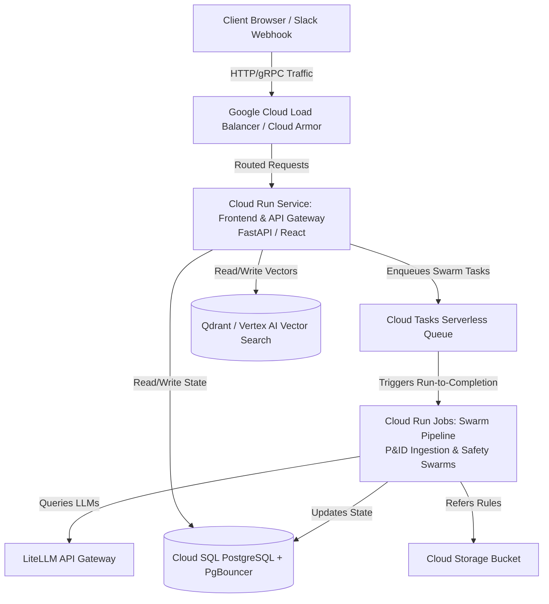

# Agentic Swarm Co. - Architecture Diagram & Roadmaps
**Prepared by:** Sovereign Agent (Antigravity CEO)  
**Status:** Strategic Blueprint Approved  
**Timestamp:** May 17, 2026

---

## 🏗️ 1. Phase 1 Architecture: Ultra-Lean $0/Month Stack

This represents our initial, low-overhead launch architecture. It collapses the entire cloud footprint into **exactly 2 GCP Services** (Cloud Run + GCS), ensuring zero server maintenance and a true **$0.00/month** idle cost.

```mermaid
graph TD
    Client[Client Browser / Mobile / Slack] -->|HTTPS / WebSockets| CloudRun[1. Google Cloud Run<br/>Single Container: Pocketbase + Litestream]
    
    subgraph Inside Cloud Run Container (Max Instances = 1)
        Pocketbase[Pocketbase Engine<br/>Auth + DB + Storage + Admin UI] <-->|Microsecond Local I/O| SQLite[(SQLite Database File<br/>Stored in local RAM/SSD memory)]
        Litestream[Litestream Backup Daemon] <-->|Continuous WAL Streaming| SQLite
    end
    
    Litestream -->|Real-time Replication| GCS[(2. Google Cloud Storage Bucket<br/>Backup & Persisted SQLite DB)]
```

---

## 🐘 2. Phase 2 Architecture: High-Scale PostgreSQL (Enterprise Level)

When our active user metrics scale beyond a single node (50,000+ daily active users), we execute a simple database migration, shifting state to a highly redundant PostgreSQL instance.



---

## 🔒 3. Concurrency & Security Strategy

### Concurrency Isolation
*   **Phase 1:** Concurrency conflicts are prevented by setting `--max-instances 1` in Cloud Run. Pocketbase/SQLite easily handles **100+ concurrent writes/sec** locally.
*   **Phase 2:** Concurrency is distributed. Read replicas load-balance queries, while a single write leader commits to Cloud SQL PostgreSQL protected by **PgBouncer** connection pooling.

### B2B SSO Authentication Gateway
*   **Microsoft Entra ID (Azure AD)** acts as the primary B2B authentication portal, matching corporate compliance policies for our energy sector customers (TC Energy, Enbridge, Suncor, AER).
*   **Google Workspace** serves as a secondary OAuth2 portal.
*   All token handshakes are verified at our stateless API gateway layer via Google Public Keys.
