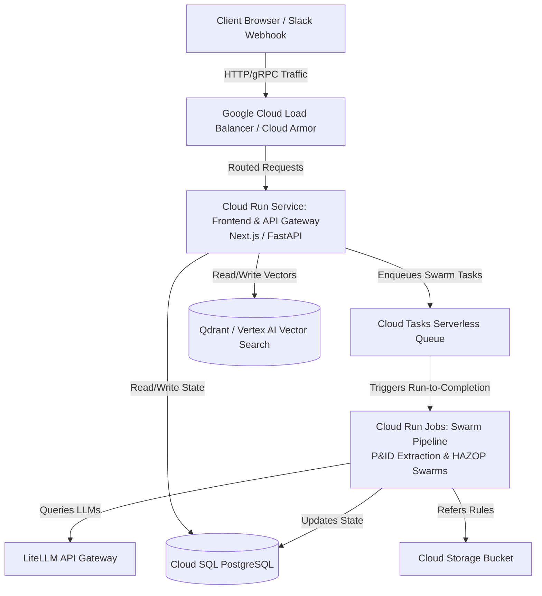

# Cloud Run Serverless Architecture: High-Scale Deployment Blueprint
**Prepared by:** Sovereign Agent (Antigravity CEO)  
**Target:** Scale-to-Zero, Low-Cost, Enterprise-Grade Swarm Infrastructure  
**Timestamp:** May 17, 2026

---

## 🏗️ 1. Executive Summary: Yes, We Can Host the Entire App

Hosting an entire enterprise-grade application (frontend, APIs, orchestrators, and data connectors) on **Google Cloud Run** is not only possible but represents a **highly strategic, production-grade architecture** for Agentic Swarm Co. 

Cloud Run eliminates server maintenance, automatically scales to handle thousands of concurrent requests, and—critically for a startup—**scales to absolute zero** when idle. This matches our **Zero Platform Fee / Low-Cost** philosophy perfectly while ensuring we are ready for enterprise spikes.

---

## 🚀 2. Scalability Dynamics: Concurrency & Horizontal Scaling

Cloud Run provides two independent scaling levers that must be balanced to maintain high performance and low costs.

### A. Concurrency (Vertical Coexistence)
*   **The Concept:** The number of simultaneous HTTP requests a single container instance handles.
*   **Default/Max:** Defaults to 80; configurable from `1` to `1,000` concurrent requests per instance.
*   **Application to Our Stack:**
    *   **I/O-Bound Components (API Gateway, Frontend):** We configure high concurrency (`150 - 250`). Since these services mostly wait on database calls, LiteLLM, or vector retrievals, the CPU remains free, allowing a single container to process hundreds of requests simultaneously, dramatically reducing cold starts and keeping costs near zero.
    *   **CPU-Bound / Heavy Async Tasks:** Set concurrency lower (`5 - 15`) to prevent CPU throttling.

### B. Horizontal Scaling (Autoscaling)
*   **The Concept:** Cloud Run spins up new instances as container concurrency limits or CPU/Memory thresholds are met.
*   **Limits:** Can scale up to **thousands of instances** automatically in seconds.
*   **Scale to Zero:** When traffic drops to 0, all container instances are terminated. **We pay $0 for compute when idle.**

---

## 🛠️ 3. The 4-Tier Serverless Architecture Blueprint

To run a fully scalable application on Cloud Run, we break down our system into stateless and stateful tiers:

### Tier 1: Frontend & API Services (Stateless)
*   **Technology:** Fast API Gateway (Python/FastAPI) and Frontend Dashboard (Vite / Next.js / HTML5).
*   **Deployment:** **Cloud Run Services**.
*   **Configuration:** 
    *   Scale-to-zero enabled (`--min-instances 0`).
    *   Concurrency: `100`.
    *   Memory: `1GB`, CPU: `1` (vCPU).

### Tier 2: The Agent Swarm Executor (Long-Running Tasks)
*   **The Challenge:** Agentic workflows (like P&ID Digitization and HAZOP Safety interpretation) take minutes or hours to complete. A standard HTTP service timeout is not ideal for this.
*   **The Solution: Cloud Run Jobs + Cloud Tasks**
    *   Instead of keeping an HTTP connection open, the API Gateway immediately publishes a message to **Cloud Tasks** (a serverless queue) and returns a `202 Accepted` response.
    *   Cloud Tasks invokes a **Cloud Run Job** to execute the pipeline.
    *   **Limits:** Cloud Run Jobs run-to-completion tasks support a timeout of up to **7 days (168 hours)** per task! This is more than enough for deep regulatory or engineering swarm analyses.
    *   **Scaling:** Jobs can execute hundreds of tasks in parallel, allowing us to process hundreds of P&ID documents concurrently.

### Tier 3: Stateful Data Layer (Managed Databases)
Since Cloud Run is stateless, all persistent data is moved to managed, scalable Google Cloud databases inside a secure **VPC (Virtual Private Cloud)**:
1.  **Relational Database:** **Cloud SQL for PostgreSQL** (or serverless **AlloyDB** for high-velocity reads).
2.  **Vector Store:** **Vertex AI Vector Search** (or a dedicated VM running **Qdrant** connected via VPC).
3.  **Connection Pooling (CRITICAL):** Because Cloud Run can scale horizontally to hundreds of containers instantly, it can easily exhaust database connection limits. 
    *   *Solution:* Use **PgBouncer** (or built-in Cloud SQL connection pooling) and set `--max-instances` limits on Cloud Run services (e.g., maximum `20` instances) to protect the database from connection exhaustion.

### Tier 4: The Shared Asset Layer
*   **Storage:** **Google Cloud Storage (GCS)** is mounted to the Cloud Run container via Cloud Storage FUSE, or accessed via client APIs. Files (uploaded P&ID PDFs, compliance CSVs, dynamic HTML reports) are stored here securely.

---

## ⚡ 4. Mitigating the Serverless "Gotchas"

| Challenge | Impact on Swarm Stack | Cloud Run Solution |
| :--- | :--- | :--- |
| **Cold Starts** | The first request after a period of idleness takes 2-5 seconds to boot. | 1. Use **`--cpu-boost`** to double CPU capacity during startup. 2. Keep a warm pool (`--min-instances 1`) *only* for the primary API gateway. 3. Minimize Docker image size (use `python:3.11-slim`). |
| **Database Exhaustion** | Hundreds of scaling containers open too many connections. | 1. Implement **PgBouncer** or connection pooling in the backend. 2. Impose strict **`--max-instances`** controls. |
| **State Disruption** | Cloud Run instances are ephemeral and restart periodically. | 1. All agent progress is checkpointed to PostgreSQL after each tool call. 2. Handle standard shutdown signals (`SIGTERM`/`SIGTSTP`) to cleanly flush logs. |
| **Secrets Management** | Storing API keys (Claude, MiniMax, Slack webhooks). | Mount credentials dynamically from **Google Secret Manager** directly into environment variables. |

---

## 💰 5. ROI & Cost Analysis: Server vs. Serverless

For an early-stage startup targeting Alberta's energy market, the financial comparison between dedicated VMs (like AWS EC2 or GCP GCE) and Cloud Run is stark:

| Metric | Traditional Dedicated VM | Cloud Run (Serverless) |
| :--- | :--- | :--- |
| **Idle Cost** | ~$150 - $400/month (running 24/7 for database + web server + orchestrators). | **$0/month** (if no requests are running, compute scales to zero). |
| **Traffic Spike Cost** | High latency or crash unless manually/expensively pre-scaled. | Auto-scales to match spike; billed strictly by the millisecond of active execution. |
| **DevOps Overhead** | Continuous patching, firewall configuration, OS upgrades. | **Zero OS management**. Just deploy container images. |
| **GTM Speed** | Slow infrastructure setup (Terraform, Docker Swarm/K8s). | **Minutes**. Deploy straight from local terminal or GitHub Action. |

---

## 🎯 6. Strategic Recommendations & Next Steps

To transition **Agentic Swarm Co.** to a highly scalable, investor-ready Cloud Run model:

1.  **Dockerize All Sub-Components:** Our existing Dockerfile is a solid foundation. We should ensure the frontend dashboard and backend worker can be built as unified or distinct slim containers.
2.  **Separate the Web API and Swarms:** Keep the Flask/FastAPI interface as a **Cloud Run Service** (fast, reactive, high concurrency) and package long-running agent workflows in `src/swarm` as a **Cloud Run Job** triggered asynchronously.
3.  **Local Development Parity:** Use docker-compose.yml locally (using PostgreSQL, Qdrant, and LiteLLM) to mirror the production Cloud Run environment exactly, keeping developer cycles friction-free.

*Status: Research Complete. The Cloud Run ecosystem is highly recommended and scalable for the Sovereign Agentic Workforce.*
