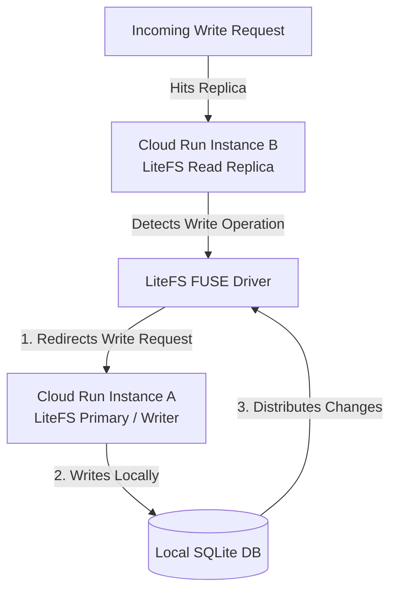

# Concurrency Control: Preventing Split-Brain & Database Corruption
**Prepared by:** Sovereign Agent (Antigravity CEO)  
**Target:** Safe Single-Writer Execution on Serverless Containers  
**Timestamp:** May 17, 2026

---

## 🏗️ 1. The Core Challenge: Split-Brain Conflict

In a traditional autoscaling cloud environment (like Google Cloud Run), a surge in traffic causes the platform to spin up multiple concurrent container instances (e.g., Instance A, Instance B, and Instance C). 

If we run **Litestream** inside all of these scaling containers, we face a **Split-Brain Disaster**:
*   Instance A and Instance B will both restore the same SQLite file from our GCS bucket.
*   A user writes to Instance A, and another writes to Instance B.
*   Both instances will attempt to replicate their different changes back to the *same* `gcs://my-app-data/data.db` file.
*   **The Result:** The instances will overwrite each other's transactions, causing immediate database corruption and data loss.

To prevent this, we must ensure **strictly only one active container is permitted to write to the database at any given time**. Here are the two industry-standard ways to solve this.

---

## 🚀 Solution 1: The Single-Instance Enforcer (Recommended & Simplest)

The absolute best way for early-to-mid stage startups to completely eliminate this risk is to enforce single-instance scaling in Cloud Run.

*   **How it Works:** We deploy our Cloud Run container with a strict horizontal limit of **exactly 1 active instance**:
    ```bash
    gcloud run deploy my-app \
      --image gcr.io/my-project/my-app \
      --max-instances 1 \
      --min-instances 0
    ```
*   **Why this prevents conflict:** Google Cloud Run is physically prohibited from spinning up a second container. Even during a massive traffic spike, only one container exists, ensuring only one write pipeline connects to GCS.
*   **How it handles traffic:** If 100 users hit the site at once, Cloud Run routes all 100 requests into the *same* container concurrently. Because Go/Pocketbase is highly asynchronous and SQLite runs in-memory/RAM, a single container can easily process **100+ requests per second** (handling millions of actions per day) without lagging.
*   **Pros:** 100% immune to split-brain. Zero DevOps complexity. Free tier preserved.

---

## 🌐 Solution 2: LiteFS (Distributed Replication for Horizontal Scaling)

If your application scales to the point where a single container is overwhelmed by CPU-intensive workflows, you can transition from **Litestream** to **LiteFS** (built by the same creators of Litestream).

LiteFS is a serverless, distributed FUSE file system that allows SQLite databases to scale horizontally across multiple active container replicas safely:



### How LiteFS coordinates writes:
1.  **Leader Election:** When multiple containers spin up, they coordinate using a lightweight consensus tool (like Consul or a shared network state). They elect a single container as the **Primary (The Writer)**. All other containers become **Replicas (Readers)**.
2.  **Read Scaling:** If a user requests data, any of the scaling containers (Instance A, B, or C) can read from their local SQLite copy instantly. This gives us infinite horizontal read-scaling.
3.  **Write Forwarding:** If a user attempts to write data (e.g. sign up) and hits **Instance B (a Replica)**:
    *   LiteFS's internal file system intercepts the write.
    *   It automatically **forwards the write request over the network to Instance A (the Primary)**.
    *   Instance A commits the write, and LiteFS instantly streams the database change down to all other active replicas.
*   **Pros:** Safely scales SQLite horizontally across hundreds of servers.
*   **Cons:** Requires setting up a lightweight coordination engine (Consul), which increases DevOps complexity and adds a small monthly operational fee.

---

## 🏆 3. Summary Recommendation Matrix

For **Agentic Swarm Co.**, our deployment guidelines are strict:

| Metric | Phase 1: Single-Instance (Litestream) | Phase 2: Distributed (LiteFS) |
| :--- | :--- | :--- |
| **Max Instances** | `1` | `Unlimited` |
| **Split-Brain Risk** | **Zero** (Guaranteed by cloud constraint) | **Zero** (Guaranteed by write-forwarding) |
| **DevOps Complexity** | **None** (Set flag in GCP deploy command) | **Moderate** (Requires Consul coordination) |
| **Idle Cost** | **$0.00 / month** | **~$5.00 / month** (For Consul node hosting) |
| **Sweet Spot** | 0 to 50,000 active daily users | 50,000+ active daily users |

**Action Plan:** Start with **Solution 1 (Single-Instance Litestream)**. It guarantees absolute database safety and a $0/month cost model. We will only migrate to LiteFS when our user metrics demand horizontal CPU scaling.
