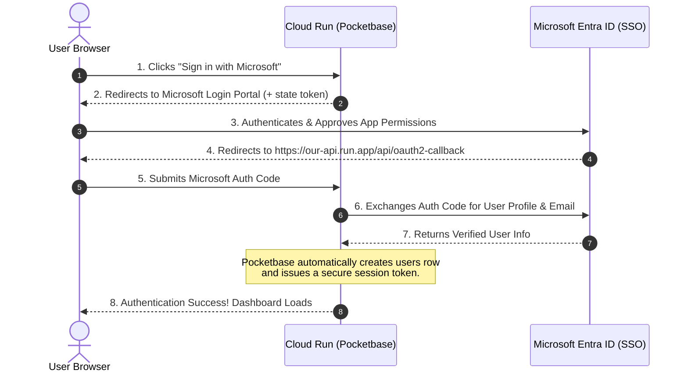

# Enterprise OAuth Strategy: B2B Single Sign-On (SSO) Blueprint
**Prepared by:** Sovereign Agent (Antigravity CEO)  
**Target:** Industrial B2B & Energy Sector Compliance Authentication  
**Timestamp:** May 17, 2026

---

## 🏗️ 1. Executive Summary: Microsoft is King in B2B Energy

For **Agentic Swarm Co.**, our target market is Western Canada's industrial, safety, and energy sectors (companies like TC Energy, Enbridge, Suncor, Cenovus, and regulatory bodies like the AER). 

In this market, **Microsoft Entra ID (formerly Azure Active Directory)** is the absolute king. Nearly 95% of mid-to-large cap energy enterprises run their entire corporate identity on Microsoft's cloud. 

To win enterprise contracts and bypass long security review cycles, we must support **Microsoft Entra ID SSO** out of the box. Pocketbase makes this incredibly simple and completely serverless.

---

## 🚀 2. Recommended OAuth Providers for Our Stack

### 1. Microsoft Entra ID (Azure AD) — *Primary Enterprise Gateway*
*   **Target Audience:** Energy operators, engineering consultants, environmental inspectors, safety officers.
*   **Why it is essential:** Enterprise IT departments will **not** allow their engineers to create individual email/password accounts on a third-party startup site. They require Single Sign-On (SSO) so they can instantly revoke access when an employee leaves the company.
*   **Pocketbase Status:** Natively supported via the OpenID Connect (OIDC) or Azure AD provider tab.

### 2. Google Workspace — *Secondary Business Gateway*
*   **Target Audience:** Mid-market consultancies, small safety startups, environmental agencies, and our internal developers.
*   **Why it is useful:** Fast, friction-free signup for smaller firms running on Google Workspace.
*   **Pocketbase Status:** Natively supported with a single checkbox.

### 3. Okta / SAML 2.0 — *Custom Enterprise Gateway*
*   **Target Audience:** Massive multinational operators with highly customized identity providers.
*   **Why it is useful:** Advanced compliance standard for custom enterprise integrations.
*   **Pocketbase Status:** Supported via OpenID Connect (OIDC) endpoints.

---

## ⚙️ 3. How Our Ultra-Lean Stack Handles OAuth (Zero Code Required)

In a traditional backend, setting up OAuth2 requires writing hundreds of lines of code to handle state tokens, CSRF protection, redirect URIs, requesting access tokens, and fetching user profiles.

With our **Pocketbase + Litestream** setup, **Pocketbase handles 100% of the OAuth2 handshake natively with zero code**.



---

## 🔒 4. Configuring Enterprise OAuth in Pocketbase

To active enterprise SSO in our stack:

1.  **GCP Secret Manager:** Store your Microsoft Client Secret securely. Mount it into your Cloud Run container's environment variables (`MICROSOFT_CLIENT_SECRET`).
2.  **Open the pocketbase Admin Panel:** Navigate to **Settings > Auth providers**.
3.  **Enable Microsoft:** Toggle the Microsoft provider on.
4.  **Paste Credentials:**
    *   **Client ID:** Enter the Application ID from your Azure Portal registration.
    *   **Client Secret:** Reference your environment variable.
5.  **Save:** That is it. The frontend can now log users in securely using:
    ```javascript
    const authData = await pb.collection('users').authWithOAuth2({ provider: 'microsoft' });
    ```

---

## 🔒 5. Strategic Benefits of B2B SSO

*   **Security Compliance (SOC 2):** Delegating credentials to Microsoft Entra ID instantly satisfies key security requirements. We do not store corporate passwords, meaning we are completely immune to password database leaks.
*   **Instant IT Approval:** Large operators (like TC Energy) can easily authorize our application tenant-wide in their Azure AD Portal, allowing all their engineers to access **Vision Swarm** instantly.
*   **User Provisioning:** Pocketbase automatically creates a matching user record inside our local SQLite database during the very first SSO login, keeping signups frictionless.

*CEO Strategic Recommendation:* Support **Microsoft Entra ID** and **Google Workspace** as our primary authentication gates. This positions Agentic Swarm Co. as a mature, enterprise-ready partner from day one.
