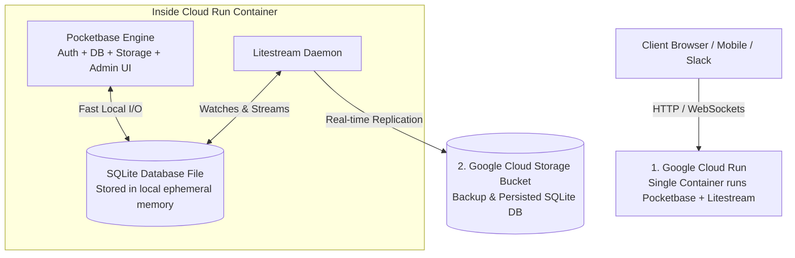

# The Ultra-Lean 2-Service Stack: Bypassing Cloud Complexity
**Prepared by:** Sovereign Agent (Antigravity CEO)  
**Target:** Collapse GCP footprint to 2 Services & $0/Month Idle Cost  
**Timestamp:** May 17, 2026

---

## 🏗️ 1. Executive Summary: The Ultimate Startup Cheat Code

If your goal is to minimize DevOps overhead, avoid managing multiple services (like Firebase Auth, Cloud SQL, VPCs, and Secret Manager), and maintain an absolute **$0.00/month** idle cost, you can collapse your entire startup stack into **exactly 2 Google Cloud Services**:

1.  **Google Cloud Run** (Compute & Web Hosting)
2.  **Google Cloud Storage (GCS)** (Object & Data Backup Storage)

To achieve this, we replace the sprawling microservices stack with a single unified backend engine: **Pocketbase** (or a single FastAPI app with SQLite) paired with **Litestream** for serverless database replication.



---

## 🚀 2. The Unified Engine: Pocketbase

Instead of writing code to connect different cloud services together, we run a single pre-compiled binary in our Cloud Run container called **Pocketbase**. 

Pocketbase is an open-source, lightweight backend that packages everything you need into a single file:
*   **Embedded Relational DB:** High-performance **SQLite** database out-of-the-box (no SQL servers to manage).
*   **Authentication Service:** Built-in email/password signup, email verification, password resets, and corporate SSO/OAuth2 (Microsoft, Google, GitHub).
*   **File Storage:** Easily routes file uploads directly to our GCS bucket.
*   **Real-time WebSockets:** Instantly pushes notifications and database changes to the frontend.
*   **Admin Dashboard:** A fully responsive administrative console to inspect users, records, and schemas without writing database client tools.

---

## 💾 3. The Persistence Engine: Litestream

Because Cloud Run is stateless and scales to zero, any file saved inside the container gets deleted when the container sleeps. To prevent database loss, we use **Litestream**, a lightweight, open-source SQLite replication daemon.

### How it works under the hood (Zero Data Loss):
1.  **On Container Boot:** Litestream runs a restore command. It instantly downloads the latest `database.db` file from our **GCS Bucket** and drops it into Cloud Run's local, fast memory. This takes a split-second.
2.  **During Operation:** Pocketbase launches and queries the local SQLite database. It runs at ultra-fast local disk speeds (no network latency). 
3.  **Active Replication:** As users sign up or write data, Litestream watches the database file's write-ahead log (WAL) and **instantly streams every transaction to GCS** in the background.
4.  **On Scale-to-Zero:** When there is no traffic, Cloud Run shuts down. The local database is deleted, but **100% of our data is safely stored in our GCS bucket**.

---

## 📊 4. Sprawling Stack vs. Ultra-Lean Stack

| Feature | Sprawling Stack (10 GCP Services) | Ultra-Lean Stack (2 GCP Services) |
| :--- | :--- | :--- |
| **GCP Services** | Cloud Run, Firebase Auth, Cloud SQL, VPC, Tasks, GCS, Secrets, Artifact Registry, etc. | **1. Cloud Run** (Compute)<br/>**2. Cloud Storage** (Data) |
| **Database** | Managed Cloud SQL PostgreSQL | Embedded SQLite + Litestream replication |
| **User Auth** | Google Identity Platform / Firebase | Built-in Pocketbase Identity |
| **Idle Cost** | **~$24.00 / month** (SQL DB + VPC Connector) | **$0.00 / month** (100% scales to zero) |
| **Maintenance** | **High** (Network configuration, IAM policies, DB pools) | **Zero** (1 Docker container, 1 Storage bucket) |
| **Scaling Limit** | Infinite horizontal scaling | Single-instance active scaling (Up to 100+ requests/sec) |

*Note on scaling:* Because Pocketbase is single-instance, we configure Cloud Run with `--max-instances 1`. However, a single Pocketbase container running on Cloud Run can easily process over **100 concurrent requests per second** (handling thousands of active daily users) because SQLite operates at lightning-fast local CPU/RAM speed.

---

## 🛠️ 5. Step-by-Step Implementation Path

To spin up this $0/month architecture:
1.  **Define GCS Bucket:** Create a single Google Cloud Storage bucket (e.g. `my-app-data`).
2.  **Create the Dockerfile:** Configure a Docker container that bundles Pocketbase and Litestream. The entrypoint script simply runs:
    ```bash
    # Restore database from GCS
    litestream restore -if-replica-exists -o /pb/pb_data/data.db gcs://my-app-data/data.db
    
    # Run Litestream replication side-by-side with Pocketbase
    exec litestream replicate -exec "/pb/pocketbase serve --http=0.0.0.0:8080" gcs://my-app-data/data.db
    ```
3.  **Deploy to Cloud Run:** Deploy the container with `--max-instances 1` and `--min-instances 0` to enable scale-to-zero.
4.  **Done:** You now have a complete, production-grade application backend running for **$0/month**!

*CEO Strategic Recommendation:* For absolute simplicity, zero cost, and minimal cloud fatigue, the **Pocketbase + Litestream on Cloud Run** architecture is the ultimate operational choice for Agentic Swarm Co.
