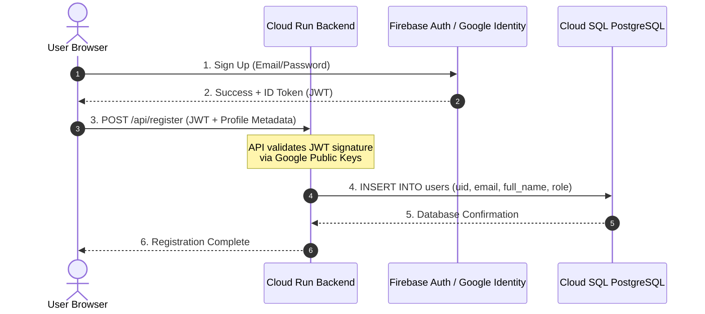

# User Auth & Database Blueprint: The Identity Split Architecture
**Prepared by:** Sovereign Agent (Antigravity CEO)  
**Target:** Secure, Enterprise-Grade User Management & Data Storage on Cloud Run  
**Timestamp:** May 17, 2026

---

## 🏗️ 1. The Strategy: Never Build Auth From Scratch

For a modern, scalable, and secure SaaS platform (especially one serving the highly regulated energy and compliance sector in Alberta), the industry standard is the **Identity Split Architecture**.

We split user signup into two distinct components:
1.  **The Authentication Layer (Who they are):** Delegated to a fully managed Identity provider (**Google Cloud Identity Platform** or **Firebase Authentication**). This handles secure password hashing, MFA, social logins (Microsoft, Google, GitHub), token issuance (JWTs), and email verification.
2.  **The Database Layer (What they do & Profile metadata):** Stored in our relational database (**Cloud SQL for PostgreSQL**). This table references the Auth service's unique identifier (`uid`) and holds application-specific profiles, organization IDs, workspace configurations, and billing state.



---

## 🔐 2. Component 1: The Authentication Layer (Firebase Auth / GCP Identity Platform)

Building a custom login table with hashed passwords in a database is a major liability. It invites security risks, requires continuous auditing, and distracts from core business value.

### Why Firebase Auth / Identity Platform is the Best Fit:
*   **Zero Infrastructure:** 100% serverless, zero maintenance.
*   **Security out-of-the-box:** Automatic DDoS prevention on login pages, brute-force protection, and secure session management.
*   **MFA & OAuth:** Easily add multi-factor authentication (SMS/TOTP) or corporate Single Sign-On (SAML/OIDC for enterprise clients) with toggle switches.
*   **Cost Efficiency:** **3,000 Monthly Active Users (MAUs) are entirely free** on Identity Platform, and standard email/password Firebase Auth is free practically forever.

---

## 🗄️ 3. Component 2: The Relational Database (Cloud SQL for PostgreSQL)

Once the user is authenticated, we write their application state and profile metadata to **PostgreSQL**. 

### The Schema Blueprint:
We link the authentication identity to our relational tables using a clean schema structure:

```sql
-- Enable UUID generation if needed
CREATE EXTENSION IF NOT EXISTS "uuid-ossp";

-- 1. Organizations/Workspaces Table
CREATE TABLE organizations (
    id UUID PRIMARY KEY DEFAULT uuid_generate_v4(),
    name VARCHAR(255) NOT NULL,
    billing_tier VARCHAR(50) DEFAULT 'free', -- 'free', 'pro', 'enterprise'
    created_at TIMESTAMP WITH TIME ZONE DEFAULT CURRENT_TIMESTAMP
);

-- 2. Users Table (Core signup profile information)
CREATE TABLE users (
    -- The uid MUST match the UID returned from Firebase/Identity Platform exactly
    uid VARCHAR(128) PRIMARY KEY, 
    organization_id UUID REFERENCES organizations(id) ON DELETE SET NULL,
    email VARCHAR(255) UNIQUE NOT NULL,
    full_name VARCHAR(255) NOT NULL,
    role VARCHAR(50) DEFAULT 'viewer', -- 'admin', 'analyst', 'viewer'
    created_at TIMESTAMP WITH TIME ZONE DEFAULT CURRENT_TIMESTAMP,
    updated_at TIMESTAMP WITH TIME ZONE DEFAULT CURRENT_TIMESTAMP
);

-- Indexing for high-performance sign-in lookups
CREATE INDEX idx_users_organization ON users(organization_id);
```

### Why Cloud SQL PostgreSQL is the Best Way:
1.  **IAM Authentication (Passwordless DB Access):** 
    Your Cloud Run container does not need database passwords stored in its code. It authenticates using its **IAM Service Account Identity**. Google automatically rotates the credentials every hour, eliminating the risk of credentials leaking in logs.
2.  **Row-Level Security (RLS):**
    PostgreSQL natively supports Row-Level Security. We can guarantee that a user from *Company A* can absolutely never view safety/P&ID data belonging to *Company B*, satisfying rigorous compliance audits.
3.  **Point-in-Time Recovery (PITR):**
    Automated backups and write-ahead logs allow us to restore the database to any exact millisecond, preventing data loss during outages.

---

## ⚙️ 4. The Registration Flow (Step-by-Step)

1.  **Frontend Registration:** The user fills out a registration form. The frontend client library sends the email/password directly to Google Identity Platform:
    ```javascript
    import { getAuth, createUserWithEmailAndPassword } from "firebase/auth";
    const auth = getAuth();
    const userCredential = await createUserWithEmailAndPassword(auth, email, password);
    const idToken = await userCredential.user.getIdToken();
    ```
2.  **API Registration Handshake:** The frontend sends the generated `idToken` (JWT) along with metadata (e.g. Full Name, Organization) to our FastAPI/Flask endpoint on Cloud Run.
3.  **Token Validation (State Verification):** The backend validates the JWT's signature against Google's public certificates. This guarantees the token is authentic, unexpired, and belongs to the user.
4.  **Database Write:** The backend inserts the `uid`, `email`, and other details into the `users` table. If it's a new company signup, it creates an `organizations` row first.

---

## ⚡ 5. Summary Recommendation Matrix

| Metric | Firebase Auth + Cloud SQL | Rolling Your Own DB Auth |
| :--- | :--- | :--- |
| **GTM Velocity** | **Fastest** (Ready in hours) | **Slow** (Weeks of coding, hashing, sessions) |
| **Security Audits** | **Enterprise Ready** (Google Compliance certified) | **High Risk** (Liable to leaks, session injection, CSRF) |
| **Scalability** | **Infinite** (Auth handles millions of requests seamlessly) | **Choked** (Auth queries compete with business data) |
| **Operational Cost** | **$0/mo** initially (Free tiers are massive) | **Variable** (High maintenance and dev hours) |

**Decision:** Adopt **Identity Split Architecture** immediately. It secures our application, streamlines corporate procurement audits, and scales perfectly on Cloud Run.
